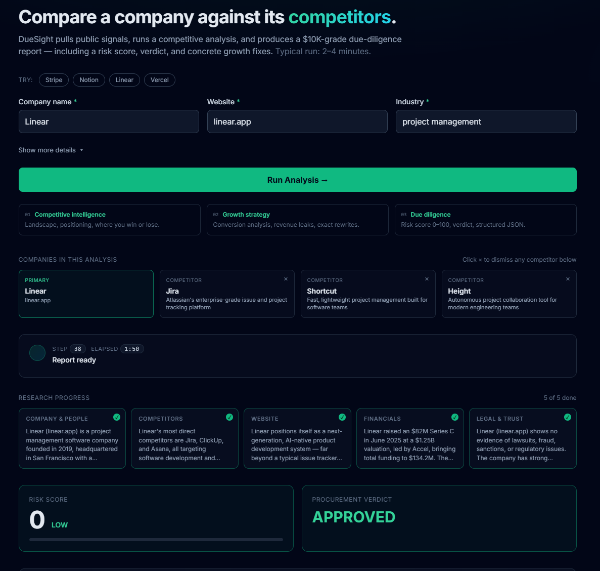

# DueSight

> Elite B2B business intelligence in 2 minutes — built for the AI Agent Economy Hackathon (April 2026).

Give DueSight a company name, website, and industry. It runs five research agents in parallel, then synthesizes a consultant-grade 9-section report covering competitive intelligence, growth strategy, and procurement-grade due diligence — including a 0-100 risk score, an APPROVED / CONDITIONAL / REJECTED verdict, and the structured JSON behind both.



## What you get

| | |
|---|---|
| **Competitive intelligence** | Landscape, positioning comparison, where the company wins or loses |
| **Growth strategy** | Website & conversion analysis, top revenue leaks, concrete rewrites |
| **Due diligence** | Risk score with auditable arithmetic, verdict, structured JSON, sources |

A typical run produces a ~25KB markdown report grounded in 30+ tool calls across web search and page fetches.

## Architecture

DueSight is a fan-out / fan-in agent — not a single iterative loop. This is what makes it fast.

```
                   ┌──────────────────────────┐
                   │  Discover competitors    │  preflight LLM call (~5s)
                   └────────────┬─────────────┘
                                │
        ┌──────────┬────────────┼────────────┬──────────┐
        ▼          ▼            ▼            ▼          ▼
   ┌────────┐ ┌────────┐  ┌─────────┐  ┌──────────┐ ┌───────┐
   │Company │ │Compet- │  │ Website │  │Financials│ │Trust &│   5 sub-agents
   │& people│ │ itors  │  │   &     │  │          │ │ legal │   in parallel
   │        │ │        │  │messaging│  │          │ │       │   (~45s wall)
   └───┬────┘ └───┬────┘  └────┬────┘  └─────┬────┘ └───┬───┘
       │          │            │             │          │
       └──────────┴────────────┼─────────────┴──────────┘
                               │
                  ┌────────────┴────────────┐
                  │      Reduce step        │
                  │  3 parallel chunks,     │  streaming
                  │  streamed token-by-token│  (~75s wall)
                  └────────────┬────────────┘
                               │
                  ┌────────────▼────────────┐
                  │   Score reconciliation  │  table sum, clamp [0,100]
                  └────────────┬────────────┘
                               │
                               ▼
                  9-section markdown report
```

Each sub-agent has its own LLM loop bounded to 3 tool batches and a 60-second deadline (`asyncio.wait_for`). One slow dimension cannot stall the others — `asyncio.gather(return_exceptions=True)` guarantees the reduce step always runs with whatever evidence finished in time.

## Performance

| Variant | Tools backend | Wall time | Time to first content |
|---|---|---:|---:|
| v1 — single loop, DuckDuckGo HTML | DDG (timing out) | ~5:30 | ~5:30 |
| v2 — single loop, Brave API | Brave Search | ~3:25 | ~3:25 |
| **v3 — fan-out + streaming reduce** | Brave Search | **~2:00** | **~50s** |

## Stack

- **Backend** — Python 3.13, FastAPI, Uvicorn, async OpenAI SDK against TokenRouter (OpenAI-compatible)
- **Search** — Brave Search API (free tier; 2k req/mo)
- **Frontend** — single-page app, no build step (Tailwind + marked + html2pdf via CDN)
- **Streaming** — Server-Sent Events with token-level deltas during the reduce step

## Setup

```bash
git clone https://github.com/altimu-agent/duesight.git
cd duesight
cp .env.example .env
# Fill in TOKENROUTER_API_KEY and BRAVE_API_KEY
pip install -r requirements.txt
```

### Web app (recommended)

```bash
uvicorn server:app --host 127.0.0.1 --port 8000 --reload
```

Then open http://127.0.0.1:8000.

### CLI

```bash
python src/agent.py "Stripe" --website stripe.com --industry payments
python src/agent.py "Acme Field Services" \
    --industry "oil and gas" --country Ecuador --contract-value 500000
```

Markdown report prints to stdout and is saved to `output/<company_slug>_<timestamp>.md`.

## API

```
GET  /                  → web UI
GET  /health            → {"status": "ok", "model": "..."}
POST /api/analyze       → SSE stream of typed events
```

`POST /api/analyze` request body:

```json
{
  "company": "Stripe",
  "website": "stripe.com",
  "industry": "payments",
  "country": "USA",            // optional
  "contract_value": 250000,    // optional, USD
  "competitors": null          // optional, array of strings (auto-discovered if null)
}
```

SSE event types: `competitors_discovered`, `dimension_started`, `dimension_completed`, `dimension_timeout`, `tool_call`, `tool_result`, `reduce_started`, `reduce_chunk_started`, `reduce_chunk_delta`, `reduce_chunk_completed`, `report`, `error`, `done`.

## Report sections

| # | Section |
|---|---|
| 1 | Company Snapshot |
| 2 | Competitor Landscape |
| 3 | Positioning Comparison |
| 4 | Website & Conversion Analysis |
| 5 | Revenue Leaks (Top 3) |
| 6 | Fixes + Rewrites |
| 7 | Growth Strategy |
| 8 | Due Diligence Report (structured JSON) |
| 9 | Risk Scoring Logic |

## Risk levels

| Score | Level | Default verdict (calibratable to contract value) |
|---:|---|---|
| 0–30 | LOW | APPROVED |
| 31–60 | MEDIUM | CONDITIONAL |
| 61–80 | HIGH | CONDITIONAL or REJECTED |
| 81–100 | CRITICAL | REJECTED |

The risk score is **pure arithmetic over the section-9 table**, clamped to [0, 100]. A deterministic `reconcile_score` in [src/agent.py](src/agent.py) re-derives the canonical score from the table after generation and overrides the JSON if the model's arithmetic disagreed — there is no LLM math in the final number.

## Project layout

```
.
├── server.py                # FastAPI app + SSE endpoint
├── src/
│   ├── agent.py             # CLI + run_agent_stream wrapper + score reconciliation
│   ├── orchestrator.py      # async fan-out: sub-agents + streaming reduce
│   ├── prompts.py           # SYSTEM_PROMPT + SUBAGENT_SYSTEM_PROMPT
│   └── tools/
│       ├── search.py        # Brave Search API
│       └── scraper.py       # httpx + BeautifulSoup page fetcher
├── static/
│   ├── index.html           # markup only
│   ├── styles.css           # all styles
│   └── app.js               # form, SSE consumer, dimension cards, streaming render
├── REDESIGN_PLAN.md         # phases & rationale
├── AGENT_PROMPT.md          # full master prompt + scoring spec
└── .env.example             # required env vars
```

## Configuration

`.env`:

```bash
TOKENROUTER_API_KEY=sk-...
TOKENROUTER_BASE_URL=https://api.tokenrouter.com/v1
MODEL=claude-sonnet-4-6
BRAVE_API_KEY=BSA...
```

Get a free Brave API key at https://api.search.brave.com/app/keys (2000 queries/month, 1 query/second).

## Roadmap

See [REDESIGN_PLAN.md](REDESIGN_PLAN.md) for phased work. Outstanding:

- **Phase 2** — Data Integrity Score (deterministic 0-100 score for source coverage / authority / diversity)
- **Phase 3** — Conversational follow-up (`POST /api/chat` to ask questions about the generated report)
- **Phase 4** — Risk Score v2 (lawsuit cap, sanctions axis, financial-stress axis, deterministic verdict-by-contract-value)
